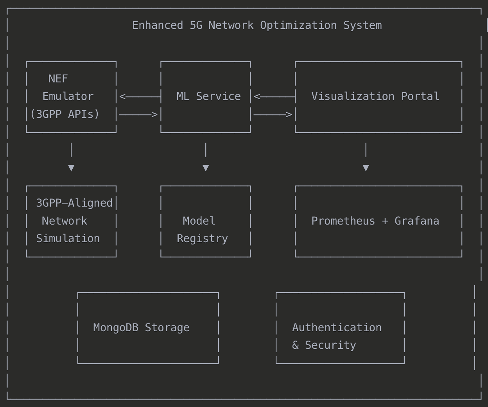

# 5G Network Optimization Thesis

## Project Overview

We're building a 3GPP-compliant 5G network optimization system that uses machine learning to dynamically select optimal antennas based on UE mobility patterns. The project:

* Uses a forked and enhanced version of the medianetlab/NEF_emulator
* Implements proper mobility patterns per 3GPP TR 38.901
* Incorporates ML-based antenna selection optimization
* Provides visualization for demonstration
* Follows enterprise-grade architecture standards

## Architecture Design

We created a microservices-based architecture with these key components:

# Understanding the NEF Emulator Structure

Looking at the `nef_structure.txt` file reveals a comprehensive FastAPI-based backend with a well-organized structure. Let me break down the key components that are relevant to our integration:

## Key Components & Integration Points

1. **UE Movement System**
   * `backend/app/app/api/api_v1/endpoints/ue_movement.py` - This is a critical integration point for our mobility models
   * `backend/app/app/models/UE.py` - Contains the data model for UEs
   * `backend/app/app/schemas/UE.py` - Defines the API schemas for UE data
2. **Network Models**
   * `backend/app/app/models/Cell.py` and `gNB.py` - These define the network elements
   * `backend/app/app/tools/5g_nr_radio.py` - Contains radio models we'll need to enhance with our RF calculations
3. **Monitoring Events**
   * `backend/app/app/api/api_v1/endpoints/monitoringevent.py` - Handles network events that we'll extend for ML integration
   * `backend/app/app/tools/monitoring_callbacks.py` - Likely implements callback mechanisms for events
4. **QoS Management**
   * `backend/app/app/api/api_v1/endpoints/qosInformation.py` and `qosMonitoring.py` - We'll need to integrate with these for QoS-aware optimizations
