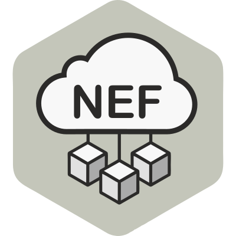

# NEF_emulator


<p align="center">
  
</p>

## Contents

- [Setup locally](#-setup-locally)
  - [Try out your setup](#try-out-your-setup)
- [How to work with a specific tag / release](#%EF%B8%8F-how-to-work-on-a-specific-tag--release)
- [NetApp communication options](#%EF%B8%8F-netapp-communication-options)
- [Integration with CAPIF](#integration-with-capif)
- [Architecture Overview](#architecture-overview)

## ⚙ Setup locally

**Host prerequisites**: `Docker version 23.0.1`, `Docker Compose v2`, `build-essential`\*, `jq`\*\*

After cloning the repository, there are four steps to get the emulator running.
You can use the provided [`Makefile`](Makefile) or invoke the `docker compose`
commands manually.

1. create your local `.env` file
2. build the container images
3. run the containers
4. add some test data (optional)

```bash
cd NEF_emulator

# 1.
make prepare-dev-env

# 2.
make build

# 3.
make up

# 4.
make db-init
```

If you prefer to run the stack without `make`, execute the equivalent commands
from this directory:

```bash
# create your .env file (see `backend/app/app/core/config.py` for variables)
docker compose build
docker compose up
```

>\* 💡 Info: *To use the `make` command you need to `apt install build-essential` first. In case you don't want to proceed with this installation, you can head over to the `Makefile` and copy/paste the shell commands that are being used for every step.*

> \*\* 💡 Info: *The shell script used at step 4 (for adding test data) uses `jq` which is a lightweight and flexible command-line JSON processor. You can install it with `apt install jq`*

### Try out your setup

After the containers are up and running:

 - access and start playing with the Swager UI at: [http://localhost:8090/nef/docs](http://localhost:8090/nef/docs) or [https://localhost:4443/nef/docs](http://localhost:4443/nef/docs)
- login to the admin dashboard at: [http://localhost:8090/login](http://localhost:8090) or [https://localhost:4443/login](http://localhost:4443/login)
     - Default credentials: `admin@my-email.com` / `pass`
     - they can be found/changed inside your `.env` file
- Prometheus metrics available at [http://localhost:8090/metrics](http://localhost:8090/metrics)

<br><br>

## Environment Variables

The emulator reads several variables from `.env` or the shell:

| Variable | Description | Default |
|----------|-------------|---------|
| `ML_HANDOVER_ENABLED` | Enable ML-based handovers (`1` or `0`) | `0` |
| `ML_SERVICE_URL` | URL of the ML service used for predictions | `http://ml-service:5050` |
| `ML_LOCAL` | Use the local ML package instead of the `ml-service` container (`1` or `0`) | `0` |
| `A3_HYSTERESIS_DB` | A3 hysteresis value in dB | `2.0` |
| `A3_TTT_S` | A3 time-to-trigger in seconds | `0.0` |
| `NOISE_FLOOR_DBM` | Noise floor used when computing SINR | `-100.0` |

When ML handovers are enabled, `HandoverEngine` posts UE feature vectors to
`ML_SERVICE_URL/api/predict` and applies the antenna recommended by the ML
service.

Example interaction when running locally:
```bash
curl -X POST "http://localhost:8080/api/v1/ml/handover?ue_id=u1"
```

### Monitoring

Metrics for Prometheus are exposed at `/metrics`. The default Docker Compose
setup scrapes this endpoint and records counters like
`nef_handover_decisions_total` and the `nef_request_duration_seconds`
histogram.

## Local ML Mode

Set `ML_LOCAL=1` to run the emulator without the separate `ml-service`
container. In this mode the `ml_service` package must be installed inside the
NEF image and `HandoverEngine` will load the model from the path provided via
its optional `ml_model_path` argument.

Add the package installation step when building the container:

```Dockerfile
RUN pip install -e services/ml-service
```

Disable the `ml-service` service in `docker-compose.yml`:

```yaml
services:
  nef-emulator:
    environment:
      - ML_LOCAL=1
#  ml-service:
#    image: 5g-network-optimization/ml-service:latest
```

## 🏷️ How to work on a specific tag / release

After `git clone` or `git pull` you can specify the release you want to work on by just using its `tag` in the following command:

    git switch --detach tag_here

You will get into a *detached HEAD* state in Git, but this is perfectly fine, you can go back anytime by just using `git switch main`.  
Short reasoning on why we choose tags over branches:

>**A tag is immutable.**  
>[source](https://stackoverflow.com/questions/9810050/why-should-i-use-tags-vs-release-beta-branches-for-versioning/)


<br><br>


## ↔️ NetApp communication options

NetApps interact with the emulator via the REST endpoints exposed on
`http://localhost:8090` (HTTP) and `https://localhost:4443` (HTTPS) by the
`reverse_proxy` service. When running under Docker Compose, other containers can
reach the API using the hostname `backend`. Example requests for subscriptions
and location reporting are available under [`docs/test_plan`](docs/test_plan).

## Integration with CAPIF

In order to integrate NEF Emulator with CAPIF you should perform the following steps:

1. Ensure that all CAPIF services are up and running. Clone the code from the official Github repository https://github.com/EVOLVED-5G/CAPIF_API_Services, navigate to the `services/` directory and execute the following commands:

```
cd services/
sudo ./run.sh
./check_services_are_running.sh
```
These commands will start the CAPIF services and ensure that they are running correctly.

2. Configure the NEF Emulator project to join the CAPIF network by following one of the below steps based on your deployment requirements:

  - For local deployment:
Update the `EXTERNAL_NET` environment variable to `true` in the `.env` file of the NEF Emulator project. This will allow NEF containers to join CAPIF's pre-existing network called `services_default`. If you do not want to use NEF Emulator with CAPIF, change the `EXTERNAL_NET` environment variable back to false in the `.env` file. Add the following entry to the `/etc/hosts` file of the host machine:
```
127.0.0.1 capifcore
```
> This entry maps the hostname "capifcore" to the IP address `127.0.0.1`, which is the loopback address of the local network interface.

  - For deployment in separate VMs:
Update the `EXTERNAL_NET` environment variable to `false` in the `.env` file of the NEF Emulator project. Add the following entry to the `/etc/hosts` file of the host machine:
```
<ip-of-capif> capifcore
```
> This entry maps the hostname "capifcore" to the IP address of the machine that CAPIF is running on.

3. Start the NEF services by executing either the make up or make debug-up command in the NEF Emulator project directory.

> 💡 Once you have completed these steps, NEF should be successfully onboarded to the CAPIF Core Function. To confirm this, check that 12 files have been created in the `app/core/certificates/` folder.

## Architecture Overview

### Directory layout

- **backend/** – FastAPI application and Dockerfile. [`backend/app/app/main.py`](backend/app/app/main.py) defines the web server and routes.
- **antenna_models/** – Antenna implementations and radiation patterns used to simulate different base station types.
- **mobility_models/** – Example UE mobility patterns (linear, L‑shaped, etc.) and helpers for feeding trajectories to the emulator.
- **rf_models/** – Path loss and radio‑frequency utilities for computing RSRP, SINR and similar metrics.
- **docs/antenna_and_path_loss.md** – Documentation on how antenna models call these path‑loss utilities and where the relevant tests live.
- **tests/rf_models/test_massive_mimo_pattern.py** – unit test ensuring `MassiveMIMOPattern` produces finite gains.

### Core classes

`NetworkStateManager` keeps track of UEs, antennas and current connections. `HandoverEngine` decides whether to use machine learning or the built‑in `A3EventRule` based on the `ML_HANDOVER_ENABLED` variable or the number of configured antennas. The rule object is always available but only consulted when ML is disabled.

### Key files

- [`backend/app/app/main.py`](backend/app/app/main.py) – FastAPI entrypoint mounting both NEF internal APIs and the northbound interface.
- [`backend/Dockerfile.backend`](backend/Dockerfile.backend) – Builds the backend image using `tiangolo/uvicorn-gunicorn-fastapi`.


