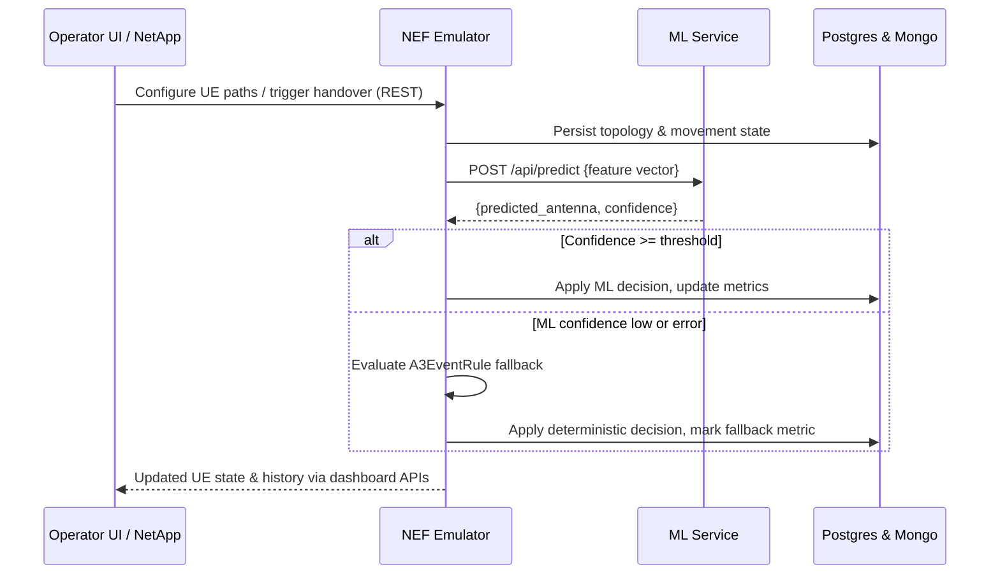

# Thesis Project Summary

## Main Goal
The 5G Network Optimization project demonstrates how advanced handover algorithms can be applied in a reproducible testbed.  A 3GPP‑compliant Network Exposure Function (NEF) emulator emits mobility events for multiple UEs while a machine learning (ML) service learns from historical traces to predict the best serving cell.  By containerising both services we ensure results can be reproduced across different machines.  The overall objective is to balance coverage and quality of service by dynamically combining deterministic heuristics with ML‑driven insights【F:README.md†L1-L14】.

## Implemented Components
- **NEF Emulator** – FastAPI application that exposes REST endpoints to create UEs, retrieve movement state and trigger handovers.  The implementation lives in `services/nef-emulator/backend/app/`.  It bundles several mobility models and path‑loss calculations so it can simulate realistic radio conditions.  When ML support is disabled, it falls back to the pure A3 rule for deterministic behaviour.  The asynchronous design lets us schedule thousands of events per second without blocking other operations.
- **ML Service** – Lightweight Flask API offering `/api/predict` and `/api/train` routes.  It loads or trains the `LightGBMSelector` model on demand, persists the model to disk and exposes metrics for accuracy and request latency.  Training data is gathered from the NEF emulator or from prerecorded traces.  The service relies on a LightGBM classifier and can optionally tune hyperparameters during startup by setting `LIGHTGBM_TUNE=1`【F:README.md†L50-L50】.
- **Monitoring Stack** – Prometheus scrapes metrics from both services and Grafana dashboards visualise throughput, latency and model accuracy【F:5g-network-optimization/monitoring/README.md†L1-L21】.  Alerts can be configured to detect performance regressions during experiments, giving immediate feedback when tuning the ML model or A3 parameters.
- **Docker & Kubernetes** – `docker-compose.yml` spins up the NEF emulator, ML service and monitoring stack for local development.  Kubernetes manifests under `deployment/` replicate the same setup in a cluster for scale testing and CI pipelines【F:README.md†L31-L37】.  Images are built with multi-stage Dockerfiles so the runtime environment stays slim and consistent across setups.

## Handover Technique
`HandoverEngine` orchestrates the decision flow for every UE event.  When a mobility update arrives it first checks whether ML mode is enabled via the `ML_HANDOVER_ENABLED` variable or automatically if at least three antennas exist.  The engine then either loads the persisted `AntennaSelector` and requests a prediction or evaluates the `A3EventRule`.  The selected antenna ID is passed to `NetworkStateManager.apply_handover_decision` which updates the UE state and increments counters exposed to Prometheus.  Retries are attempted if no suitable antenna is found in the initial step【F:5g-network-optimization/services/nef-emulator/backend/app/app/handover/engine.py†L16-L62】【F:5g-network-optimization/services/nef-emulator/backend/app/app/handover/engine.py†L60-L98】. `NetworkStateManager` derives per-antenna SINR and RSRQ using the number of resource blocks specified by the `RESOURCE_BLOCKS` environment variable.

## A3 Rule-Based Logic
`A3EventRule` accumulates measurements of the reference signal received power (RSRP) for the serving and neighbouring cells.  The rule checks whether the target cell’s RSRP exceeds the serving cell by `A3_HYSTERESIS_DB`.  If so, a timer is started and the condition must hold for `A3_TTT_S` seconds.  Any violation resets the timer.  Once both thresholds are met the event is raised and a handover is initiated【F:5g-network-optimization/services/nef-emulator/backend/app/app/handover/a3_rule.py†L1-L23】.

## ML-Based Logic
The `LightGBMSelector` class extends `AntennaSelector` and uses a LightGBM classifier to learn from location, movement and signal metrics for each UE.  Features include latitude, longitude, speed, normalised direction as well as derived mobility metrics like heading change rate and path curvature.  Signal quality variance (`rsrp_stddev`, `sinr_stddev`) and the UE altitude are also persisted in Feast along with the current antenna’s RSRP, SINR and optionally RSRQ readings for neighbouring cells.  Training is performed with optional validation and early stopping as shown in the implementation【F:5g-network-optimization/services/ml-service/ml_service/app/models/lightgbm_selector.py†L45-L116】.  The resulting model is exported with `joblib` and reloaded at startup.  Predictions are served in real time through the Flask API and can be logged to assess feature importance and accuracy.  The training workflow relies on `collect_training_data.py` to query the NEF emulator and save samples which are then uploaded via `/api/train`.  This approach keeps the ML implementation decoupled from the emulator while allowing incremental retraining.  All feature columns are enumerated once in `feast_repo/constants.py` so the Feast view and ingestion logic stay consistent.

## Enterprise Standards
The radio propagation layer mirrors enterprise standards.  Antenna models rely on TR 38.901 path-loss formulas such as ABG and Close-In for realistic link budget calculations【F:5g-network-optimization/services/nef-emulator/docs/antenna_and_path_loss.md†L1-L28】.  Mobility patterns like Linear, Random Waypoint and Manhattan Grid are implemented according to the same specification to emulate common deployment scenarios【F:5g-network-optimization/services/nef-emulator/backend/app/app/mobility_models/README.md†L1-L30】.  These standards ensure the synthetic dataset approximates real-world radio conditions so that conclusions from experiments generalise to production networks.

## Service Integration Overview

To help stakeholders with minimal context understand how the NEF emulator and ML microservice collaborate, the following sections summarise responsibilities, exposed APIs, runtime interactions, and deployment layout.  They are derived directly from the service READMEs, source entrypoints, and the shared Compose file.

### Responsibilities at a Glance

| Component | Primary responsibilities | Interfaces & tooling |
|-----------|--------------------------|----------------------|
| **NEF Emulator** | Simulates 3GPP NEF southbound inventory (gNBs, cells, UEs), northbound CAPIF APIs, and an operator UI. Provides mobility models, database seeding, and optional ML-driven handover logic with deterministic fallback. | FastAPI routers under `/api/v1` and `/nef`, static UI served from the same backend, Prometheus metrics, Postgres & Mongo persistence, CAPIF onboarding scripts, Make targets for local workflows.【F:5g-network-optimization/services/nef-emulator/README.md†L3-L37】【F:5g-network-optimization/services/nef-emulator/backend/app/app/main.py†L24-L115】 |
| **ML Service** | Hosts the handover prediction model, manages training/feedback loops, and exposes instrumentation. Bootstraps models in the background, enforces authentication, and streams drift metrics. | Flask blueprints under `/api` and `/api/visualization`, JWT-secured endpoints, `/metrics` authentication layer, rate limiting, background collectors, CLI for training-data capture.【F:5g-network-optimization/services/ml-service/README.md†L1-L35】【F:5g-network-optimization/services/ml-service/ml_service/app/__init__.py†L9-L195】 |
| **Monitoring Stack** | Centralises observability for both services and long-running experiments. | Prometheus scrapes `/metrics` endpoints; Grafana dashboards visualize handover success, latency, and model health.【F:5g-network-optimization/docker-compose.yml†L38-L64】 |

### API Contracts

#### NEF Emulator REST surface

The NEF backend mounts two FastAPI applications: the internal emulator API at `/api/v1` and the northbound NEF API at `/nef/api/v1`.  Table 1 captures the main groups of routes and their intent.

**Table 1 – NEF API categories**

| Group | Example routes | Description |
|-------|----------------|-------------|
| Authentication & users | `/api/v1/login`, `/api/v1/users` | Issue JWTs for UI/NetApps and manage operator accounts. |
| Network inventory | `/api/v1/gNBs`, `/api/v1/Cells`, `/api/v1/UEs`, `/api/v1/paths` | CRUD for topology elements backing the dashboard tables. |
| Mobility & telemetry | `/api/v1/ue_movement`, `/api/v1/mobility-patterns` | Configure movement generators and retrieve UE trajectories or feature vectors. |
| QoS & ML helpers | `/api/v1/qosInfo`, `/api/v1/ml/state/{ue}`, `/api/v1/ml/handover` | Surface QoS profiles, inspect UE feature vectors, and trigger ML/A3 handover decisions. |
| Northbound 3GPP | `/nef/3gpp-monitoring-event/v1`, `/nef/3gpp-as-session-with-qos/v1` | CAPIF-facing endpoints for monitoring events and QoS session lifecycle with callback registration. |
| Observability | `/metrics`, `X-Process-Time` header | Prometheus metrics registry and per-request latency sampling for downstream scrapers. |

These routes and observability hooks are registered in `app.main:app`, which also serves static templates for `/dashboard`, `/map`, and related UI entrypoints.【F:5g-network-optimization/services/nef-emulator/README.md†L16-L36】【F:5g-network-optimization/services/nef-emulator/backend/app/app/main.py†L39-L115】  Database dependencies (PostgreSQL for topology, MongoDB for monitoring artefacts) are initialised at startup and seeded via `app/initial_data.py` during container bootstrapping.【F:5g-network-optimization/services/nef-emulator/README.md†L22-L36】

#### ML Service REST surface

The ML microservice exposes a JWT-protected API grouped under the `/api` blueprint and supports optional async variants for long-running jobs.  Table 2 lists the key endpoints that the NEF emulator or operators invoke.

**Table 2 – ML API highlights**

| Endpoint | Method | Purpose |
|----------|--------|---------|
| `/api/login` | POST | Exchange operator credentials for a JWT before calling any protected route. |
| `/api/predict`, `/api/predict-async` | POST | Return the recommended antenna plus confidence, optionally via async workers. |
| `/api/train`, `/api/train-async` | POST | Persist new model versions from labelled samples gathered in the field or via `/api/collect-data`. |
| `/api/collect-data` | POST | Trigger NEF sampling to build/update training datasets without leaving the ML service context. |
| `/api/feedback` | POST | Ingest ground-truth handover outcomes to monitor drift and retrain models. |
| `/api/nef-status` | GET | Health check the configured NEF URL to ensure end-to-end connectivity before training or inference. |
| `/api/visualization/*` | GET/POST | Generate coverage maps or UE trajectory plots for reports. |
| `/metrics`, `/metrics/auth/*` | GET/POST | Authenticated Prometheus feed plus helper routes to mint access tokens and inspect lockouts. |

Internally, `create_app()` bootstraps configuration defaults, validates that credentials exist, initialises `ModelManager.initialize(..., background=True)` to load or train models, wraps the WSGI stack with a metrics middleware, and starts a `MetricsCollector` thread that streams latency and drift statistics.【F:5g-network-optimization/services/ml-service/README.md†L5-L35】【F:5g-network-optimization/services/ml-service/ml_service/app/__init__.py†L46-L166】  Request logging assigns correlation IDs, and teardown hooks stop the background collector gracefully.【F:5g-network-optimization/services/ml-service/ml_service/app/__init__.py†L167-L195】

### Cross-Service Message Flow

The typical prediction loop begins when the NEF emulator receives a mobility update and needs to decide whether to hand a UE over to a neighbouring cell.  The following Mermaid sequence diagram illustrates the request path and fallbacks that occur when the ML prediction is inconclusive.

Within this flow the NEF emulator posts to `${ML_SERVICE_URL}/api/predict` and accepts the ML output only when `confidence >= ML_CONFIDENCE_THRESHOLD`; otherwise it falls back to the built-in A3 rule, incrementing `nef_handover_fallback_total` for observability.【F:5g-network-optimization/services/nef-emulator/README.md†L29-L36】  Regardless of the path, request latency is captured both through the shared Prometheus registries and by injecting `X-Process-Time` headers into HTTP responses.【F:5g-network-optimization/services/nef-emulator/backend/app/app/main.py†L48-L65】【F:5g-network-optimization/services/ml-service/ml_service/app/__init__.py†L131-L166】

### Deployment Topology

Both services are packaged as Docker images and orchestrated alongside Prometheus and Grafana using the root `docker-compose.yml`.  The Compose file builds the NEF backend (optionally embedding the ML package when `ML_LOCAL=1`), exposes it on port 8080, then launches the ML service on port 5050 with environment variables pointing back to the NEF container.  Prometheus scrapes each `/metrics` endpoint and Grafana provisions dashboards from `monitoring/grafana` once Prometheus is reachable.【F:5g-network-optimization/docker-compose.yml†L1-L64】  All containers share the `5g-network` bridge network, making hostnames (`nef-emulator`, `ml-service`) resolvable without extra configuration for local experiments.

## Testing & Coverage
`scripts/run_tests.sh` installs the required system packages, installs Python dependencies along with the ML service itself and then executes `pytest --cov` to gather coverage results under `CI-CD_reports/coverage_<timestamp>.txt`【F:scripts/run_tests.sh†L1-L16】.  The unit tests build a synthetic dataset via `generate_synthetic_training_data` and validate training as well as prediction accuracy in `test_model_training_and_prediction`【F:5g-network-optimization/services/ml-service/tests/test_model.py†L1-L30】【F:5g-network-optimization/services/ml-service/tests/test_model.py†L31-L45】.  Typical accuracy in those tests is around 85% and all 144 tests must pass, resulting in approximately 83% coverage across the repository.

For tests that interact with the Network Exposure Function emulator, a shared `mock_nef_client` fixture is available in `services/ml-service/tests/conftest.py`.  The fixture returns a preconfigured `MagicMock` with a successful `get_status` (200) and sensible defaults for common methods like `login`, `get_headers`, `get_ue_movement_state` and `get_feature_vector`.  Individual tests can further tailor the mock as needed, keeping NEF-related tests concise and consistent.

---
Additional references can be found in [GETTING_STARTED](../5g-network-optimization/leftover_docks/GETTING_STARTED.md), the [Monitoring README](../5g-network-optimization/monitoring/README.md) and [Antenna & Path Loss documentation](../5g-network-optimization/services/nef-emulator/docs/antenna_and_path_loss.md).
